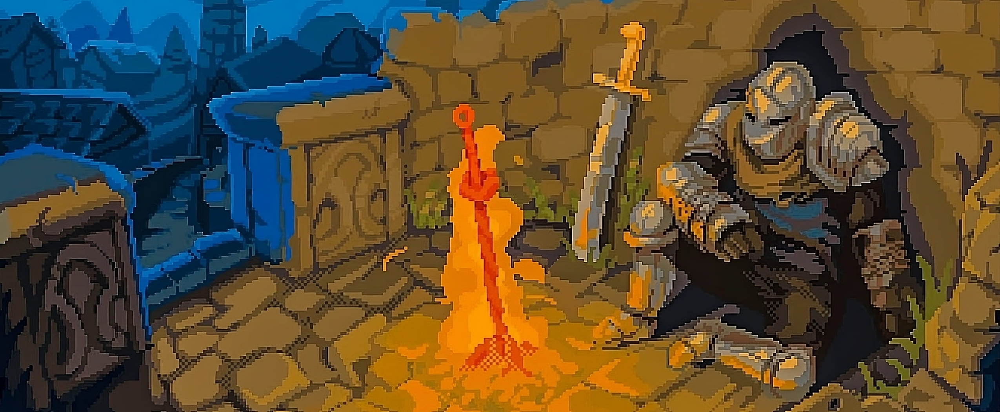

#  Erick Malcoaccha

**`Natzgun (Developer/Computer Science Student)`**

I am a **software developer passionate about technology**, with a strong focus on **computer graphics**.  I consider myself an *autodidact* and a continuous learner, always seeking challenging problems that push me to grow and expand my knowledge.  

Currently, I am an **indie learner in computer graphics**, building personal projects while exploring the mathematics and processes behind modern graphics. 

I love linux, but I am interested in Arch Linux, I love the linux terminal

My <a href="https://erickmalcoaccha.vercel.app/" target="_blank">portfolio here!</a>

   

      
      
      
   

---

### 🧰 Languages and Tools

 

<!-- <h3 align="center">Hey there, I'm Erick Malcoaccha</a>  </h3>

Hello, My name is Erick, 22 years with 1 years of experience.
I love linux, but I am interested in Arch Linux, I'm a
computer sciencist, I love the linux terminal -->

---
### 👨‍💻 I am interested in:
- 🎨 Computer Graphics  
- 🛠️ Software Engineering  
- 🎮 Game Development  
- 🐧 Linux & Operating Systems  
- 🏗️ Domain-Driven Design (DDD)  

---

### 🐧 Operating Systems I use

 

---

### 📊 Stats

---

### 💻 Most used languages

---

